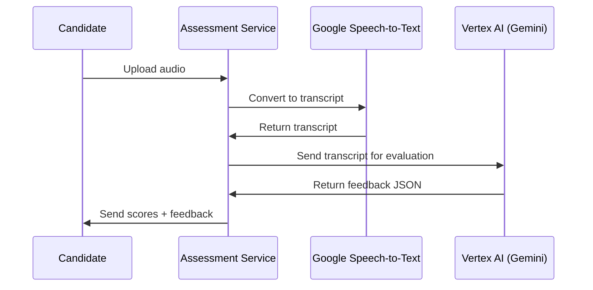

# Assessment Service – FastAPI + Vertex AI + Speech-to-Text

This service provides a backend for conducting AI-powered mock interviews.
It handles two tasks:
1. **Speech-to-Text**: Converts candidate audio responses into transcripts.  
2. **Answer Evaluation**: Uses a Gemini model (via Vertex AI) to evaluate transcripts, giving structured feedback and scores.  

---

## Features
- **POST /generate-transcript**  
  Upload audio (`.mp3`, `.ogg`, `.webm`) → returns transcript text.  
  - Uses Google Cloud Speech-to-Text.  
  - Handles audio conversion automatically.  

- **POST /generate**  
  Submit a transcript → returns JSON feedback with:  
  - Scores (Relevance, Correctness, Depth, Clarity, Specificity)  
  - Strengths  
  - Weaknesses  
  - Improvements  

- Built with **FastAPI** and ready for deployment on **Google Cloud Run**.  
- Designed for integration with interview platforms.  

---

## Setup

### 1. Clone the Repository

```bash
git clone https://github.com/yourusername/resume-web-tool.git
cd resume-web-tool/assessment-service
```

### 2. Add Your Service Account Key

- **Do NOT commit this file to version control!**
- Download your Google Cloud service account key (JSON) and place it in the project directory (e.g., `local-bliss-465905-r3-acb77d2aff76.json`).
- Add the key filename to your `.gitignore`:
  ```
  *.json
  ```

### 3. Install Dependencies

```bash
pip install -r requirements.txt
```

### 4. Set Environment Variable

```bash
export GOOGLE_APPLICATION_CREDENTIALS="./local-bliss-465905-r3-acb77d2aff76.json"
```

### 5. Run Locally

```bash
uvicorn proxy:app --host 0.0.0.0 --port 8080
```

---

## Usage

1. Send a POST request to `/generate` with a JSON body:

```bash
curl -X POST http://localhost:8080/generate-transcript \
  -F "file=@answer.mp3"
```

Response:

```json
{
  "transcription": "I would use a hash map because it allows O(1) lookups..."
}
```

2. Evaluate Transcript
```bash
curl -X POST "http://localhost:8080/generate" \
  -H "Content-Type: application/json" \
  -d '{"text": "I would use a hash map because it allows O(1) lookups..."}'
```

Response:
```json
{
  "scores": {
    "relevance": 9,
    "correctness": 8,
    "depth": 7,
    "clarity": 8,
    "specificity": 6
  },
  "strengths": ["Relevant approach", "Clear reasoning"],
  "weaknesses": ["Could provide more detail"],
  "improvements": ["Add examples of edge cases", "Discuss time-space tradeoffs"]
}
```
---

## Deploying to Google Cloud Run

1. **Build and push the Docker image:**
   ```bash
   gcloud builds submit --tag gcr.io/YOUR_PROJECT_ID/proxy
   ```
2. **Deploy to Cloud Run:**
   ```bash
   gcloud run deploy proxy \
     --image gcr.io/YOUR_PROJECT_ID/proxy \
     --platform managed \
     --region YOUR_REGION \
     --allow-unauthenticated \
     --port 8080
   ```
3. **After deployment, Cloud Run will provide a public HTTPS URL for your service.**

---

## Architecture Overview

  
---

## Security Best Practices

- **Never commit your service account key to version control.**
- Restrict the service account's permissions to only what is necessary.
- Monitor usage and set up billing alerts in Google Cloud Console.
- Consider adding authentication, rate limiting, or API keys if exposing the endpoint publicly.

---

## License

MIT

---

## Disclaimer

This project is provided as-is. Use at your own risk. You are responsible for securing your Google Cloud resources and managing API usage and billing.
